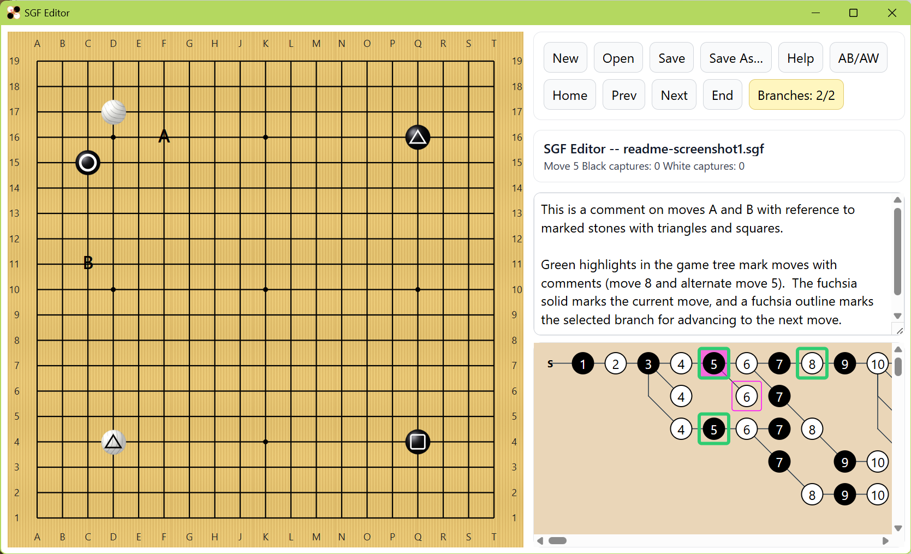

# sgfeditor-react


# Project Description

SGF Editor reads and writes .sgf files and supports editing game trees, annotating board positions, commenting on moves, etc.  It has several useful commands for reviewing games, including saving in reverse view to give a copy to your opponent.  You can also just use it as a Go board to play a game.  (For search purposes: goban, baduk, weiqi.)

_This version uses typescript/react/vite/electron, and legacy python and a few C# versions (WPF, store app, and UWP) are at https://github.com/billchiles/sgfeditor_




For notes on how to try out the app, see below the list of commands.


## From the Help command ... 

PLACING STONES AND ANNOTATIONS:
Click on a board location to place alternating colored stones.  You can click the
last move in a series of moves to undo or delete it.  Shift click places a square 
annotations, ctrl click places triangles, and alt click to place letter annotations.  
If you click on an adornment location twice, it toggles whether there is an adornment.

AB/AW/AE EDIT MODE:
F2 toggles Edit Mode (shift-F2 exits) in which left click places black stones or 
removes existing stones, and right click places white stones or removes existing stones.
This creates setup nodes in the middle of the game.

KEEPING FOCUS ON BOARD FOR KEY BINDINGS
Escape will always return focus to the board so that the arrow keys work
and are not swallowed by the comment editing pane.

NAVIGATING MOVES IN GAME TREE
Right arrow moves to the next move, left moves to the previous, up arrow selects
another branch or the main branch, down arrow selects another branch, home moves
to the game start, and end moves to the end of the game following the currently
selected branches.  You can always click a node in the game tree graph.  Ctrl-left
arrow moves to the closest previous move that has branches.  If the current move
has branches following it, the selected branch's first node has a fucshia
square outlining it.  Nodes that have comments have a light green highlight, and
the current node has a fuchsia highlight.

CREATING NEW FILES
The new button (or ctrl-n) prompts for game info (player names, board size,
handicap, komi) and creates a new game.  If the current game is dirty, this prompts
to save.

OPENING EXISTING FILES
The open button (or ctrl-o) prompts for a .sgf file name to open.  If the current
game is dirty, this prompts to save.  Opening a file already open switches to that game.
Ctrl-c copies filepath to clipboard.

MULTIPLE OPEN FILES
You can open multiple games.  Shift-w rotates through games (can't stop chrome
from stealing ctrl-w).  When creating or opening games, SgfEditor closes the 
default game if it is unused.  Ctrl-alt-f4 closes the current game in the browser,
and ctrl-f4 closes in electron.

SAVING FILES, SAVE AS
The save button (or ctrl-s) saves to the associated file name if there is one;
otherwise it prompts for a filename.  To explicitly get save-as behavior, 
use ctrl-alt-s (browser) or ctrl-shift-s (electron).  Ctrl-c copies filepath to clipboard.

SAVING REVERSE VIEW
To save the game so that your opponent can review it from their point of view, use
ctrl-shift-alt-f in browser and electron.

CUTTING MOVES/SUB-TREES AND PASTING
Delete or c-x cuts the current move (and sub tree), making the previous move the
current move.  C-v will paste a cut sub tree to be a next move after the current
move.  If the the sub tree has a move that occupies a board location that already
has a stone, you will not be able to advance past this position.  You can paste a
cut sub tree from a second open game with c-s-v.

MOVING BRANCHES
You can move branches up and down (affects branch combo and game tree display)
You must be on the first move of a branch, and then you can use ctrl-uparrow or 
ctrl-downarrow to move the branch up or down to change the order of branches.

PASSING
c-p will make a pass move.

MISCELLANEOUS
 * Ctrl-k clears the current comment and puts text on system clipboard.
 * Ctrl-1, ..., ctrl-5 delete the first, ..., fifth line of the current comment and
      puts entire comment's text on clipboard.
 * Ctrl-t changes the first occurrence of the current move's board coordinates in the comment
      to 'this'; for example, 'd6 is strong cut' changes to 'this is strong cut'.
 * Ctrl-m changes the first occurrence of board coordinates to 'marked stone',
      'square-marked stone', or a letter depending on what adornment is at that location.

F1 produces this help.

There is an auto save feature if something resets the app.  It also autosaves every 30s
and a few seconds after the last activity that modifies the game.  Opening a file that 
has a newer auto save file prompts for which to open.  Launching the app checks for an 
unnamed auto save file less than 12 hours old in case you were noodling on the default
board.


## How to try it out
There are two easy paths to try it out, but to do anything you do need to install Node.js + npm.  You can get by without installing git by using github's feature to download a zip file of the sources.  These instruction focus on Windows, but Mac folks can "brew npm" and follow most of the instructions below to try out the app (the path that builds the installer doesn't work on Macs).

Optionally install git (source code revision control system)

The recommended way to get Node.js + npm is to use the NVM for Windows Node.js version manager.  Download nvm-setup.zip from https://github.com/coreybutler/nvm-windows and run the nvm-setup.exe. Then execute the command:

```
nvm install lts
```

That installs the latest stable Node.js + npm.  Alternatively, you can install Node.js directly from https://nodejs.org.

Then get the sources with (if you have git installed):
```
git clone https://github.com/billchiles/sgfeditor-react.git
```
Otherwise, you can go to https://github.com/billchiles/sgfeditor-react and click the green button "<> Code", which drops down to show a link to download a zip file.

Change into the folder git or you created and execute the command:

```
npm install
```

This installs all dependencies needed to run and build the app. It installs many modules, but this is normal and only the necessary code is included in builds.

Two easy ways to try the app (first in a cmd.exe window, cd to the app directory):

- Execute:

```
npm run dev
```

This starts the Vite dev server hosting the app and prints a URL (typically http://localhost:5173). Open a browser and navigate to this URL to see the app.

- Execute:

```
npm run app:prod
```

This builds and runs the app's exe in an Electron window.  This is the closest experience to using the installed app.  The "app:prod" command is a shortcut for the following:

```
npm run build
npm run build:electron
npm run start:electron
```

## How to build and install
On Windows you can build an installer and install the app to get file activation (double click .sgf files to launch the app), start menu invocation, normal file access, etc.

Execute:

```
npm run dist:win
```

This produces an installer at:

```
...\dist\SGFEditorR-setup-<version>.exe
```

Execute the installer to fully eanble the app on Windows.

## One more way to run the app
You can use the "npm run dev:electron" command to launch the electron shell hosting the app talking to the app's vite host server.  This also launches a debug tools window that you can close.  The live app updates if you modify sources due to vite watching sources and rebuilding.

You can also execute:

```
npm run dev:electron
```

This launches the Electron shell connected to the Vite dev server.  A developer tools window may open (you can close it).  The app will live-update as you modify source files.

